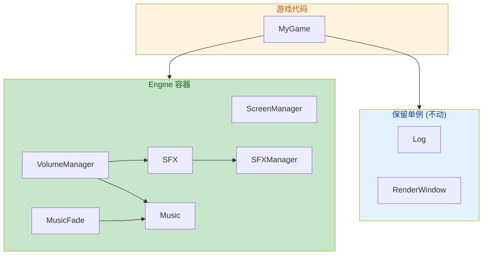

# 去单例化重构参考指南

## 概述

本文档列出引擎中所有需要去单例化的类及具体改动方法。

### 基本原则

| 类别 | 类 | 处理方式 |
|------|-----|---------|
| **保留单例** | `Log`, `RenderWindow` | 全局唯一，保留不动 |
| **去单例化** | `ScreenManager`, `SFX`, `Music`, `MusicFade`, `SFXManager`, `VolumeManager` | 去掉 `GetInstance()`，改为普通成员变量 |

---

## 1. ScreenManager

**文件**：`Window/Manager/ScreenManager.hpp`、`Window/Manager/ScreenManager.cpp`

### 改动清单

| # | 文件 | 行号 | 当前代码 | 改成 |
|---|------|------|---------|------|
| 1.1 | ScreenManager.hpp | ~44 | `ScreenManager() = default;` 在 `private:` 下 | 移到 `public:` 下 |
| 1.2 | ScreenManager.hpp | ~51 | `static auto GetInstance() -> ScreenManager&;` | **删除此行** |
| 1.3 | ScreenManager.cpp | ~20-23 | `auto ScreenManager::GetInstance() -> ScreenManager& { static ScreenManager instance; return instance; }` | **删除整个函数** |

### 改动后用法

```cpp
// 以前
auto& mgr = atom::ScreenManager::GetInstance();
mgr.PushScreen("menu");

// 以后
atom::ScreenManager screen_mgr;
screen_mgr.PushScreen("menu");
```

### 使用者（需要同步更新）

- `Window/RenderWindow.hpp` 第 83 行：`atom::ScreenManager::GetInstance()`
- `Window/RenderWindow.cpp`（通过头文件间接引用）

---

## 2. Music

**文件**：`Media/Audio/Music.hpp`、`Media/Audio/Music.cpp`

### 改动清单

| # | 文件 | 行号 | 当前代码 | 改成 |
|---|------|------|---------|------|
| 2.1 | Music.hpp | ~37 | `Music() = default;` 在 `private:` 下 | 移到 `public:` 下 |
| 2.2 | Music.hpp | ~44 | `static auto GetInstance() -> Music&;` | **删除此行** |
| 2.3 | Music.cpp | ~21-24 | `Music& Music::GetInstance() { static Music instance; return instance; }` | **删除整个函数** |
| 2.4 | Music.hpp | ~31 | `static float music_volume_;` | 改为 `float music_volume_{100.0f};`（成员初始化） |
| 2.5 | Music.cpp | ~18 | `float atom::Music::music_volume_ = 100.0f;` | **删除此行**（初始化移到声明处） |

### 改动后用法

```cpp
// 以前
atom::Music::GetInstance().Play("bgm");

// 以后
atom::Music music;
music.Play("bgm");
```

### 使用者（需要同步更新）

- `Media/Audio/Plug/MusicFade.cpp` 第 65 行：`Music::GetInstance()`
- `Media/Audio/Plug/MusicFade.cpp` 第 214 行：`Music::GetInstance()`
- `Media/Audio/Manager/VolumeManager.cpp` 第 30 行：`Music::GetInstance()`
- `Media/Audio/MusicFade.cpp` 第 305、311 行：`Music::GetInstance()`

---

## 3. SFX

**文件**：`Media/Audio/SFX.hpp`、`Media/Audio/SFX.cpp`

### 改动清单

| # | 文件 | 行号 | 当前代码 | 改成 |
|---|------|------|---------|------|
| 3.1 | SFX.hpp | ~31 | `SFX() = default;` 在 `private:` 下 | 移到 `public:` 下 |
| 3.2 | SFX.hpp | ~39 | `static auto GetInstance() -> SFX&;` | **删除此行** |
| 3.3 | SFX.cpp | ~25-28 | `SFX& SFX::GetInstance() { static SFX instance; return instance; }` | **删除整个函数** |
| 3.4 | SFX.hpp | ~28 | `static float sfx_volume_;` | 改为 `float sfx_volume_{100.0f};`（成员初始化） |
| 3.5 | SFX.hpp | ~60 | `static auto SetSfxVolume(float volume) -> void;` | 改为 `auto SetSfxVolume(float volume) -> void;`（去 static） |
| 3.6 | SFX.hpp | ~62 | `static auto GetSfxVolume() -> float;` | 改为 `auto GetSfxVolume() -> float;`（去 static） |
| 3.7 | SFX.hpp | ~73 | `static auto Update() -> void;` | 改为 `auto Update() -> void;`（去 static） |
| 3.8 | SFX.cpp | ~100-106 | 对应的 static 方法实现 | 去掉 `static` |
| 3.9 | SFX.cpp | ~123 | `auto SFX::Update() -> void {}` | 去掉 `static` |
| 3.10 | SFX.cpp | ~17 | `float atom::SFX::sfx_volume_ = 100.0f;` | **删除此行**（移到 VolumeManager.cpp 处理） |

### 改动后用法

```cpp
// 以前
atom::SFX::GetInstance().Play("explosion");

// 以后
atom::SFX sfx;
sfx.Play("explosion");
```

### 使用者（需要同步更新）

SFX 的静态方法还被 `VolumeManager` 调用，详见第 6 节。

---

## 4. MusicFade

**文件**：`Media/Audio/Plug/MusicFade.hpp`、`Media/Audio/Plug/MusicFade.cpp`

### 改动清单

| # | 文件 | 行号 | 当前代码 | 改成 |
|---|------|------|---------|------|
| 4.1 | MusicFade.hpp | ~47 | `static auto GetInstance() -> MusicFade& { static MusicFade instance; return instance; }`（内联在类中） | **删除此行** |
| 4.2 | MusicFade.hpp | 构造函数当前为默认 | 不需要改，已经是隐式 public | 无操作 |

### 改动后用法

```cpp
// 以前
atom::audio::MusicFade::GetInstance().Switch("bgm2", 1.0f);

// 以后
atom::audio::MusicFade fade;
fade.Switch("bgm2", 1.0f);
```

### 重要：MusicFade 依赖 Music 实例

`MusicFade` 当前硬编码调用 `Music::GetInstance()`，去单例化后需要传入 `Music` 引用：

```cpp
// 方式一：构造函数注入（推荐）
class MusicFade {
public:
    explicit MusicFade(Music& music) : music_(music) {}
private:
    Music& music_;
};

// 方式二：方法参数传递
auto MusicFade::Switch(Music& music, const std::string& toId, float duration) -> bool;
```

使用者：
- `Media/Audio/Plug/MusicFade.cpp` 全部 15 处 `Music::GetInstance()` 调用

---

## 5. SFXManager

**文件**：`Media/Audio/Manager/SFXManager.hpp`、`Media/Audio/Manager/SFXManager.cpp`

### 改动清单

| # | 文件 | 行号 | 当前代码 | 改成 |
|---|------|------|---------|------|
| 5.1 | SFXManager.hpp | ~28 | `SFXManager() = default;` 在 `private:` 下 | 移到 `public:` 下 |
| 5.2 | SFXManager.hpp | ~36 | `static auto GetManager() -> SFXManager&;` | **删除此行** |
| 5.3 | SFXManager.cpp | ~22-25 | `SFXManager& SFXManager::GetManager() { static SFXManager manager; return manager; }` | **删除整个函数** |

### 改动后用法

```cpp
// 以前
SFXManager::GetManager().LoadSFXFiles("id", "path");

// 以后
SFXManager sfx_mgr;
sfx_mgr.LoadSFXFiles("id", "path");
```

### 使用者（需要同步更新）

- `Media/Audio/SFX.cpp` 第 32、34 行：`SFXManager::GetManager()`

---

## 6. VolumeManager

**文件**：`Media/Audio/Manager/VolumeManager.hpp`、`Media/Audio/Manager/VolumeManager.cpp`

VolumeManager 比较特殊——它当前所有方法都是 `static`，且硬编码调用 `SFX::GetInstance()` 和 `Music::GetInstance()`。

### 改动方案

```cpp
// VolumeManager.hpp — 从纯静态类改为需要实例引用的类
namespace atom {
    class Music;
    class SFX;

    class VolumeManager {
    public:
        // 构造时注入依赖
        VolumeManager(SFX& sfx, Music& music)
            : sfx_(sfx), music_(music) {}

        auto SetSfxVolume(float volume) -> void;
        auto GetSfxVolume() -> float;
        auto SetMusicVolume(float volume) -> void;
        auto GetMusicVolume() -> float;

    private:
        SFX& sfx_;
        Music& music_;
    };
}
```

```cpp
// VolumeManager.cpp
namespace atom {
    auto VolumeManager::SetSfxVolume(float volume) -> void {
        sfx_.SetSfxVolume(volume);           // 不再是 SFX::SetSfxVolume()
    }

    auto VolumeManager::GetSfxVolume() -> float {
        return sfx_.GetSfxVolume();
    }

    auto VolumeManager::SetMusicVolume(float volume) -> void {
        music_.SetMusicVolume(volume);       // 不再是 Music::GetInstance()
    }

    auto VolumeManager::GetMusicVolume() -> float {
        return music_.GetMusicVolume();
    }
}
```

此外，`VolumeManager.cpp` 当前包含了两行静态成员定义：

```cpp
// VolumeManager.cpp 第 17-18 行 — 移到各自类的成员初始化中
float atom::SFX::sfx_volume_ = 100.0f;      // → SFX 构造函数初始化
float atom::Music::music_volume_ = 100.0f;  // → Music 构造函数初始化
```

### 改动后用法

```cpp
atom::SFX sfx;
atom::Music music;
atom::VolumeManager vol_mgr(sfx, music);

vol_mgr.SetSfxVolume(80.0f);
vol_mgr.SetMusicVolume(50.0f);
```

---

## 7. 建议的 Engine 组合类

去单例化后，建议创建一个 Engine 类来统一管理这些对象的生命周期：

```cpp
// Engine.hpp — 新建文件
#ifndef ATOM_ENGINE_HPP
#define ATOM_ENGINE_HPP

#include <Log/LogSystem.hpp>
#include <Window/RenderWindow.hpp>
#include <Window/Manager/ScreenManager.hpp>
#include <Media/Audio/SFX.hpp>
#include <Media/Audio/Music.hpp>
#include <Media/Audio/Plug/MusicFade.hpp>
#include <Media/Audio/Manager/SFXManager.hpp>
#include <Media/Audio/Manager/VolumeManager.hpp>

namespace atom {
    class Engine {
    public:
        // 核心基础设施（保留单例引用）
        Log& log = Log::GetLogInstance();
        RenderWindow& window = RenderWindow::GetInstance();

        // 业务层（Engine 拥有实例，组合关系）
        SFXManager sfx_manager;
        SFX sfx{sfx_manager};          // SFX 需接收 SFXManager 引用
        Music music;
        VolumeManager volume_manager{sfx, music};
        ScreenManager screen_manager;
        audio::MusicFade music_fade{music};  // MusicFade 需要 music 引用
    };
}

#endif
```

### 游戏中使用

```cpp
// 你的 Game 类
#include <Engine.hpp>

class MyGame {
private:
    atom::Engine engine_;

public:
    void Run() {
        engine_.music.Play("bgm");
        engine_.sfx.Play("explosion");
        engine_.screen_manager.PushScreen("menu");
        
        // 或者持有引用
        auto& music = engine_.music;
        music.Play("bgm2");
    }
};

auto main() -> int {
    MyGame game;
    game.Run();
    return 0;
}
```

---

## 8. 改完后的依赖关系图



---

## 9. 重构总览表

| # | 类 | 改动文件数 | 删除行数 | 新增行数 | 依赖处理 |
|---|-----|-----------|---------|---------|---------|
| 1 | ScreenManager | 2 | ~6 | 0 | RenderWindow 需更新调用 |
| 2 | Music | 2 | ~8 | ~2 | MusicFade、VolumeManager 需注入引用 |
| 3 | SFX | 2 | ~12 | ~6 | VolumeManager、SFXManager 需注入 |
| 4 | MusicFade | 2 | ~1 | ~3 | 需接收 Music& 构造参数 |
| 5 | SFXManager | 2 | ~6 | 0 | SFX 需接收引用 |
| 6 | VolumeManager | 2 | ~15 | ~20 | 完全重写为实例类 |
| 7 | Engine | 1 (新建) | 0 | ~50 | 新文件，统一组合 |

**总计**：约 48 行删除 / 81 行新增（含 Engine 组合类）

---

## 10. 不改动的文件

以下文件不受这次重构影响，不需要做任何修改：

- `Log/LogSystem.hpp`、`Log/LogSystem.cpp`
- `Window/RenderWindow.hpp`、`Window/RenderWindow.cpp`
- `Math/Vector/*`
- `Components/Entities/*`
- `Config/*`
- `Media/Decoder/*`
- `Media/Video/*`
- `Utilities/Packager/*`
- `Lua/*`
- `Example/*`（但可能需要微小调整以适应新的 API）
